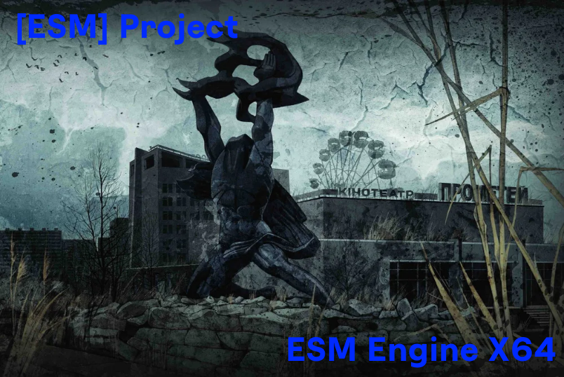

  
  
  
  

  <a href="https://github.com/morrazzzz/ESM-Engine/commits/main">
  <a href="https://github.com/morrazzzz/ESM-Engine/pulls">

  

ESM-Engine
==========================
* Движок был основан на [XRay](https://github.com/mortany/xray), а точнее его модификации для новых Visual Studio.
* Спасибо проектам, чьи наработки были здесь использованы: [XRay OMP X64](https://github.com/xrLil-Batya/xray-omp-x64), [OGSR Engine](https://github.com/OGSR/OGSR-Engine/), [STCOP Engine x64](https://github.com/mortany), SO-XRay-Engine, [Anomaly Engine](https://github.com/morrazzzz/xray-monolith-152), TSMP Engine, [NSProjectX](https://github.com/Deathman00/NSProjectX), [XRay 1.6(abramcumner)](https://github.com/abramcumner/xray16), [XRay 1.5(abramcumner)](https://github.com/abramcumner/xray15), [SoC-DX10](https://github.com/morrey/STALKER-SOC-DX10)

## Разная информация:
* О проблемах можно сообщать [сюда](https://github.com/morrazzzz/ESM-Engine/issues)
* [Авторы/Contributors](https://github.com/morrazzzz/ESM-Engine/graphs/contributors) проекта
* [Описание изменённого(Wiki, пока там пусто! Там что то будет когда будет первый релиз)](https://github.com/morrazzzz/ESM-Engine/wiki)

## Инструкция по сборке:
* Требуется актуальная версия Visual Studio 2022(Не важен тип Visual Studio, можно любой, например Community)
* Открываете ESM Engine.sln, которых находится в папке trunk
* Выбираете Release(остальное пока не работает) и x86(Win32) или x64(НЕ Рекомендуется, ИМЕЮТСЯ БАГИ!!). Далее нажимаете на кнопку собрать

## Цели проекта:
* Исправление ошибок оригинального движка
* Добавление новых возможностей для разработчиков
* Улучшение графики
* Обновление некоторых компонентов движка
* Добавление рендеров из Зова Припяти
* Очистка движка от мусора

## Основные нововведения:
* Обновлен LuaJIT
* Исправление многих ошибок
* Более стабильный код
* Настройка некоторых параметров из config`ов
* Сборка движка под 2022 студией
* Некоторые фишки из Anomaly 
* Консоль из Зова Припяти
* Исправление предупреждений при сборке
* Поддержка моделей из Зова Припяти и SDK 0.7
* Фиксы утечек памяти

## Известные проблемы:
* Вылет при выходе из игры(ведётся наблюдение)
* Резкая смена погоды(на дин. погоде, на статич. такой проблемы нету)
* Баганный x64(Например: не генерируется stack trace)